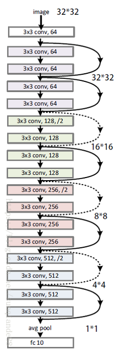
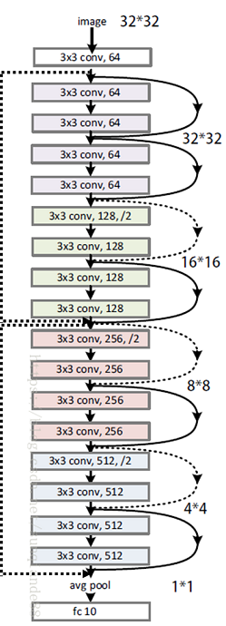
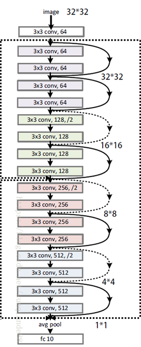

# CIFAR10-Pytorch
> For my homework \
Creating your own github account. \
Implementing your own deep neural network (in Pytorch, PaddlePaddle…). \
Training it on CIFAR10.\
Tuning a hyper-parameter and analyzing its effects on performance.
\
Writing a README.md to report your findings.
	Example： https://github.com/StanfordVL/taskonomy/tree/master/taskbank

# Train Model
> python main.py --shortcut_level shortcut-level

The training and validation log will be saved in the './logs' folder.

# Model Innovation
This model adds more residual structures based on the ResNet18. I think the residual structure not only can solve the problem of gradient explode, but also can combine the multiscale features, which will help the model to complete the task of classification better. In fact, this modification imporoved the performance of ResNet model on the CIFAR-10 dataset indeedly.

Here are three resnet model structures ordered by their shortcut level. Their shortcut levels are 1, 2, 3, from left to right. Specially, `shortcut-level=1` represents there is no change compared with the original ResNet model.

# Performance

I searched all super-parameters to find the best version of each model structure. Below is their comparison of Accuracy.

| **Shortcut Level** | **Acc** |
|:------------------:|:-------:|
| 1(baseline)        | 0.9127  |
| 2                  |**0.9169**|
| 3                  | 0.915   |

# Conclusion

From the experiment result, we can see our change on the model improves its performance. Due to its character of residual, I called it **`Res²Net`** for the model of 2 shortcut-level.